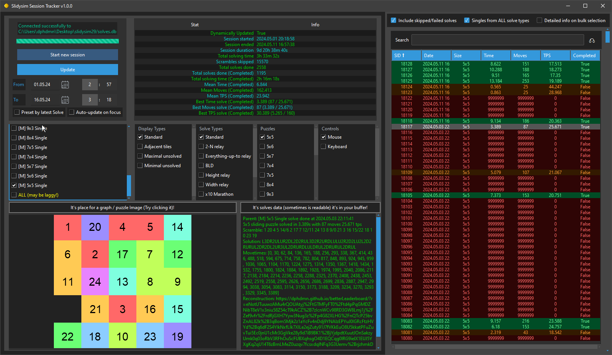
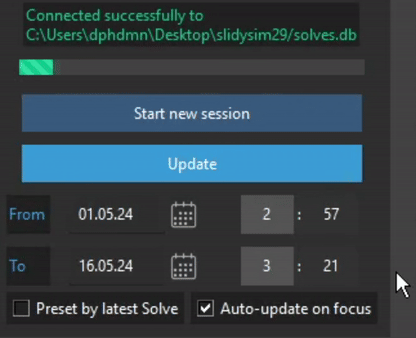
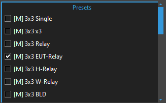
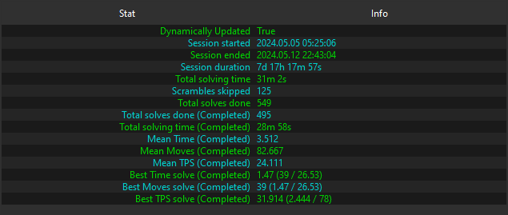
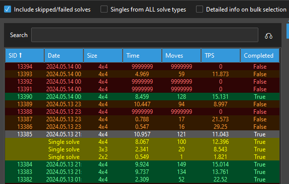
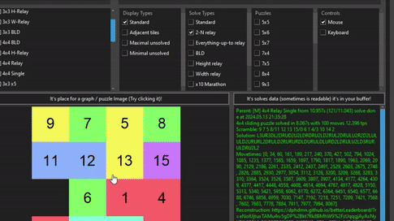
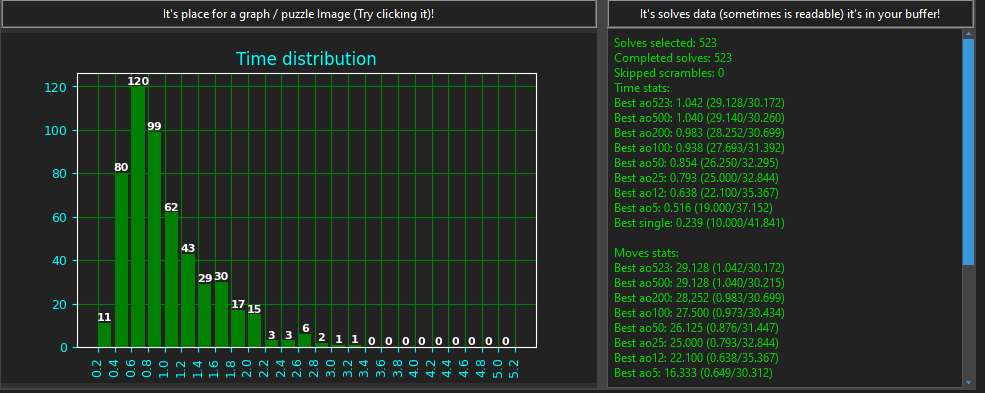
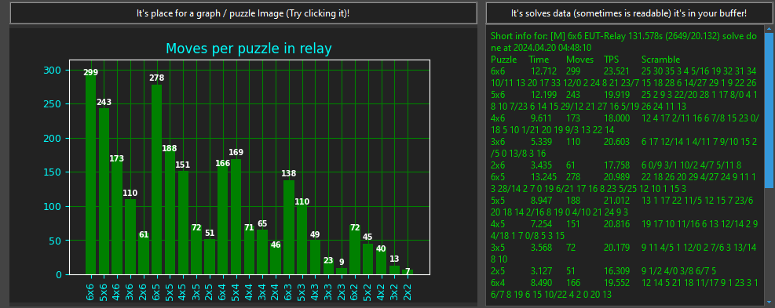

# slidysimSessionTracker
GUI application, written in Python/Tkinter to track session stats for sliding puzzle simulator slidysim.com



## [v1.0.0 windows release](https://github.com/dphdmn/slidysimSessionTracker/releases/tag/v1.0.0)

### Features:

- **Real-Time Session Tracking:** Automatically updates your session progress each time you switch to the app, loading new solves from the database. You have the option to disable this feature at any time. Load older results from the database and limit the time frame.



- **Automatic Preset Loading:** Based on the solves you complete, the app automatically loads presets of categories you have solved.



- **Comprehensive Stats:** View general session statistics including session duration, total solving time, number of solves completed/skipped/incomplete, mean stats for time, moves, TPS (turns per second), and your best solves.



- **Detailed Solves Sheet:** Access a detailed sheet containing all your solves. You can even enable skipped or unfinished solves for a complete overview. Apply various sorting options to the sheet with visualizations of completed/incomplete solves for better insights.



- **Detailed Single-Solve Analysis:** Selecting a single solve provides a detailed reconstruction of the solve, an image of the solve, and a clickable link to the reconstruction with move-times accuracy.



- **Batch Solve Analysis:** Select multiple solves to view average stats, carefully calculated with consideration of skipped and incomplete solves. Export detailed stats for each selected solve. View a histogram plot for multiple selected solves, showing the distribution of results. Click on the histogram to iterate between time, moves, and TPS images.



- **Support for Complex Solve Types:** Supports stats for complex solve types such as relay or marathon. Get general stats, different types of graphs, and information about averages of complex categories.



- **Cross-Solve Type Analysis:** By default, the app loads single results from all solve types. For example, load all 4x4 singles from 4x4 2-N relays to analyze your averages across various solve types. You can disable it at any moment.


---


# Requirements

### slidy-cli
Download it from the [slidy-cli GitHub releases](https://github.com/benwh1/slidy-cli/releases/tag/v0.2.0). 

Ensure that it is called `slidy` and is either in your system PATH or located in the same folder as the script.

### Python Libraries
Ensure you have the following Python libraries installed:

- `pyperclip`
- `ttkbootstrap`
- `matplotlib`
- `Pillow`
- `configparser`
- `tktimepicker`
- `cairosvg`

### Special Instructions for Windows Users
If you encounter issues with importing `cairosvg` on Windows, follow these steps to install `cairocffi` using `pipwin`:

1. Install `pipwin`:
   ```sh
   pip install pipwin
   ```

2. Use `pipwin` to install `cairocffi`:
   ```sh
   pipwin install cairocffi
   ```

By following these instructions, you should have all the necessary dependencies installed and configured correctly.
# Known Issues and Notes

- **Scrambler Limitations**: The program supports only the Random Permutation scrambler type. It does not support random moves or custom difficulty settings. Implementing these features would add complexity to an already cluttered interface and codebase.
  
- **Bulk Export Limitation**: When exporting selected BULK solves of complex type, singles information is not included. This data is only available when selecting one solve. In the future, I may add time, moves, and TPS information for BULK exports, but it seems largely unnecessary.

- **BLD Completion Status**: The BLD completion status is simplified. It shows `True` if the solve is completed and successful, and `False` if either condition is not met. Intermediate stages are not represented.

- **Overlap Handling**: Overlapping cases with multiple solve types selected alongside Singles have been (likely) fixed. The system should show correct total time and other stats. For example, selecting both 3x3 relay and 3x3 singles will display 4 singles and 1 relay, but only 4 solves in total, excluding the single done within the relay. This prevents overlapping, which is the correct behavior. However, this has not been extensively tested, and confusing results may still occur. Please report any such issues.

- **Update Algorithm**: The update algorithm is not optimized for handling very large amounts of solves. It is primarily designed for single sessions or short-term stats (e.g., a week). Future optimizations may include retaining previous update data and fetching only new results on each update. While updating DB requests for regular updates may be straightforward, updating all processing steps, tables, and stats is more complex and may be considered in the distant future if needed.

- **Presets for Extra Singles**: Presets are not generated for extra singles when singles are loaded as Main to avoid clutter. However, you can still find them in the "Puzzle" checkboxes list.

- **Selecting "ALL" Categories**: Adding a feature to select "ALL" categories in each list is not difficult, but it seems to have limited use. An "ALL" preset has been added to get total stats and all solves, though it may be laggy.

- **Default DB Path**: To change the default path to the database, edit or delete the config file. The app will try to connect to the default "" path and will prompt for a new path if it fails.

- **Stats Window Color Coding**: In the stats window, red indicates some of the selected solves are unfinished or skipped, while green means all selected solves are complete. This logic may be tweaked in the future.

Please report any issues or suggestions to improve the functionality and user experience.